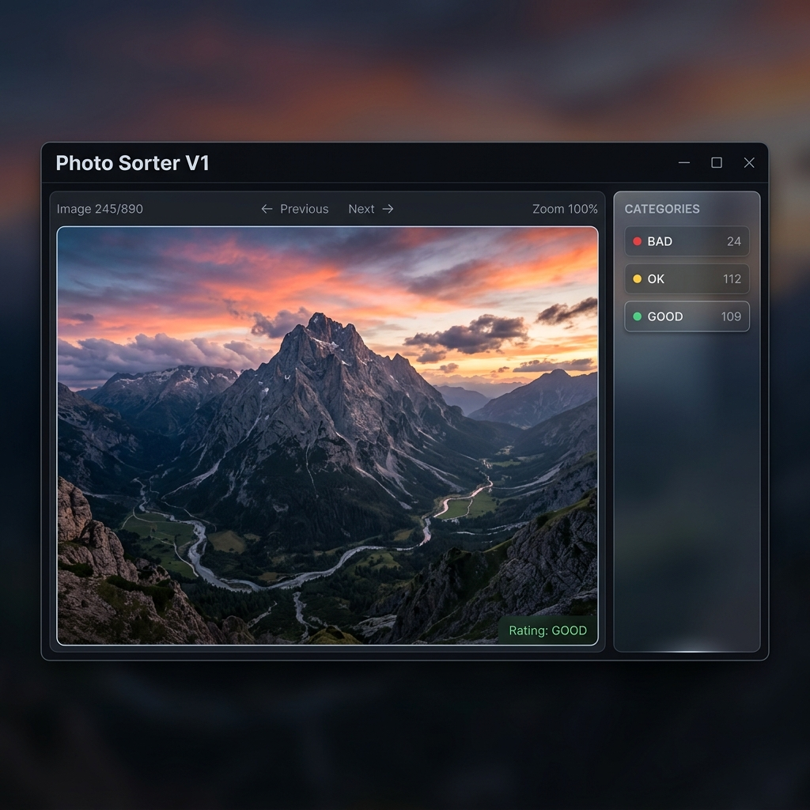

# Photo Sorter V1

  

  
  
  
  

---

**Photo Sorter V1** is a professional, high-performance desktop utility designed for rapid photo culling and organization. Built for photographers who need to move through thousands of images with zero lag and total precision.

---

## ⬇️ Downloads

| Platform | Download | Format |
| :--- | :--- | :--- |
| **🪟 Windows** | [**Download Installer**](#) | `.exe` |
| **🍎 macOS** | [**Download App**](#) | `.app` (Universal) |
| **🐧 Linux** | [**Download Bundle**](#) | `.AppImage` |

---

## 🚀 One-Click Quick Start (For Developers)

If you have **Python 3.9+** installed, you can start sorting immediately without manual configuration:

### 🪟 Windows
1. Double-click **`install.bat`** (Run once to set up).
2. Double-click **`run.bat`** to start the application.

### 🍎 macOS
1. Right-click **`install.command`** and select *Open*.
2. Run **`run.command`** to launch.

### 🐧 Linux
1. Run **`./install.sh`** to set up dependencies.
2. Run **`./run.sh`** to launch.

---

## ✨ Features

- **Photo-Hero UI**: A minimal, distraction-free interface that keeps your work centered.
- **Zero-Lag Performance**: Offloads image decoding to a background thread pool for instant navigation.
- **Smart RAW Pipeline**: Native support for professional formats (CR2, ARW, NEF) with optimized preview caching.
- **Unified Zoom**: Standardized zoom mechanics across precision touchpads, trackpads, and mouse wheels.
- **Safe & Atomic**: Non-destructive sorting with a robust checkpoint system—never lose your work or risk your originals.

---

## ⌨️ Keyboard Shortcuts

| Key | Action |
| :--- | :--- |
| **1 / 2 / 3** | Rate **BAD** / **OK** / **GOOD** |
| **N / P** | Next / Previous Image |
| **F** | Toggle Fullscreen |
| **Ctrl + Scroll** | Smooth Zoom (Cmd on Mac) |
| **Ctrl + 0** | Reset Zoom to Fit |
| **Enter** | **Finalize Export** (Preserves Folder Hierarchy) |
| **ESC** | Back to Menu |

---

## 📂 Supported Formats

- **Standard**: `.jpg`, `.jpeg`, `.png`, `.webp`
- **Professional RAW**: `.cr2`, `.arw`, `.nef` (Requires `rawpy`)

---

## 📖 Documentation

- **[Installation Guide](docs/installation.md)**: Detailed manual setup for all platforms.
- **[Architecture & Design](docs/architecture.md)**: Deep dive into the threading and memory models.
- **[Checkpoint & Safety](docs/checkpoint.md)**: Technical breakdown of the restoration logic.
- **[Full Walkthrough](docs/walkthrough.md)**: Guided tour of features and UI.

---

## 🤝 Contributing & Support

We welcome contributions! Please see our [Developer Docs](docs/architecture.md) for architecture details. For issues or feature requests, please open an issue in the repository.

Licensed under the [MIT License](LICENSE).
